# Visual Dependency Diagrams

This document contains Mermaid diagrams that visualize the architecture and dependencies of the mobile improvements feature. These diagrams can be rendered directly on GitHub.

## Component Dependency Graph

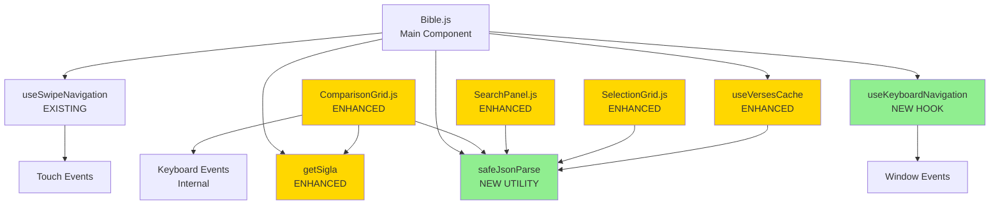

**Legend:**
- 🟢 Green = New Component/Hook
- 🟡 Yellow = Enhanced/Modified Component
- ⚪ White = Existing Component (unchanged)

---

## Data Flow - Keyboard Navigation

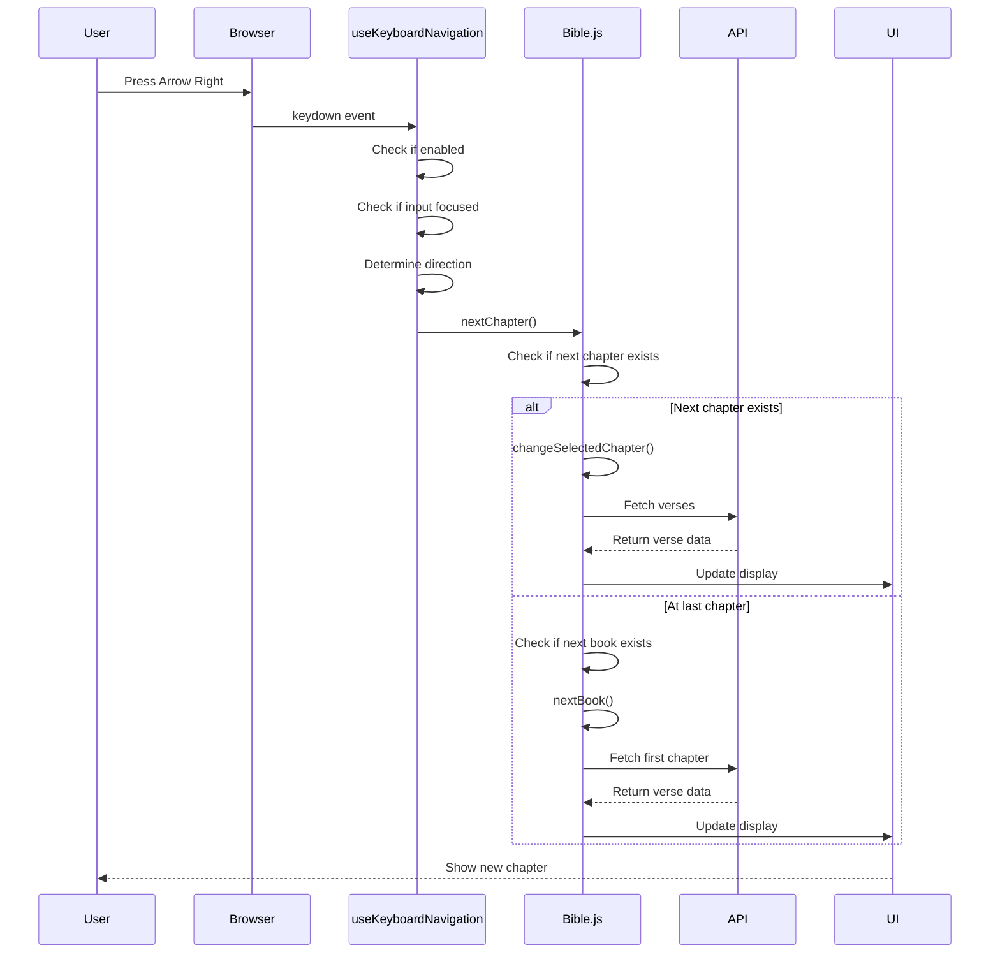

---

## Data Flow - Safe JSON Parsing

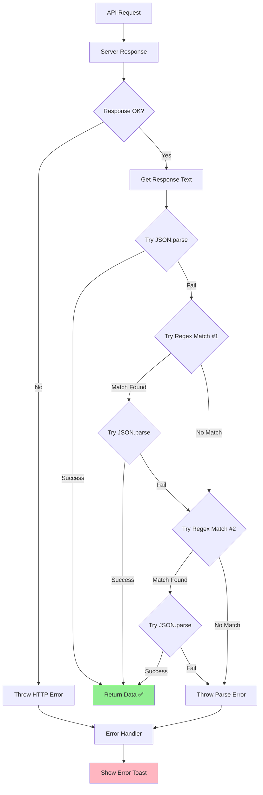

---

## State Management Flow

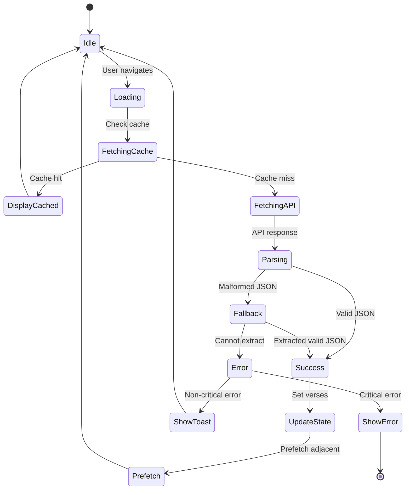

---

## Component Interaction - Keyboard Navigation

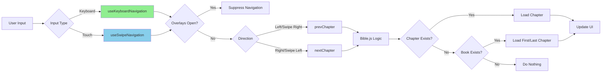

---

## Error Handling Architecture

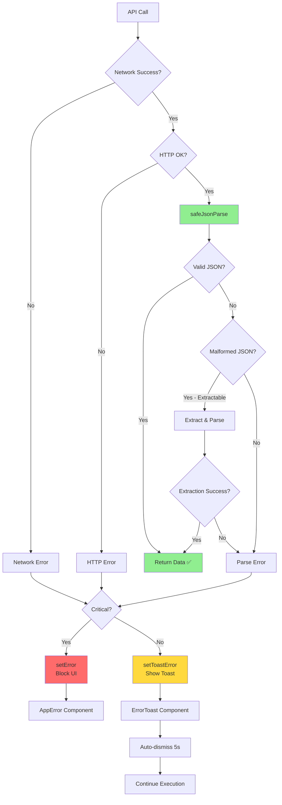

---

## Book Sigla Localization

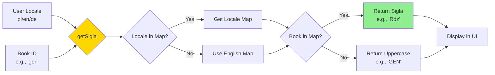

---

## Test Coverage Map

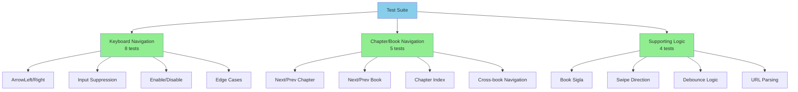

---

## Module Boundaries

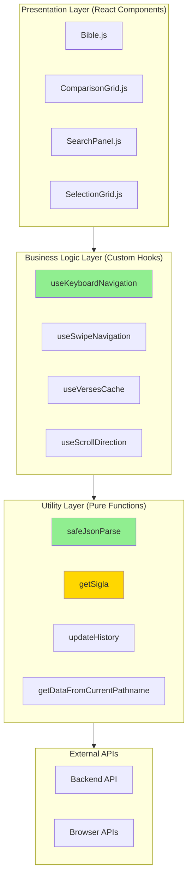

---

## Performance Impact

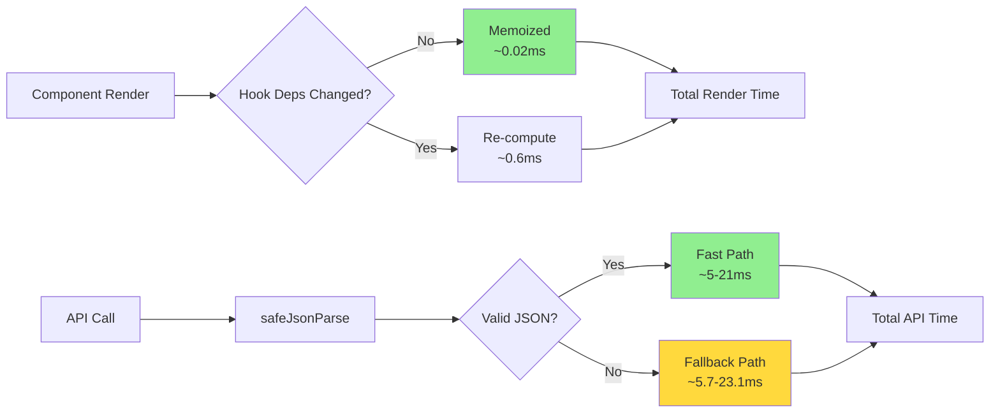

---

## Deployment Flow

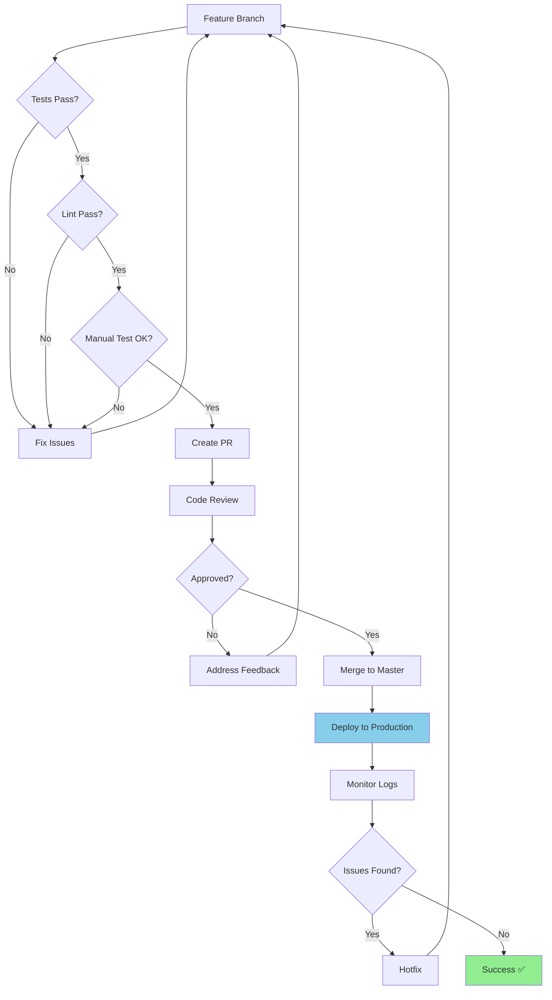

---

## Usage Example - Integration

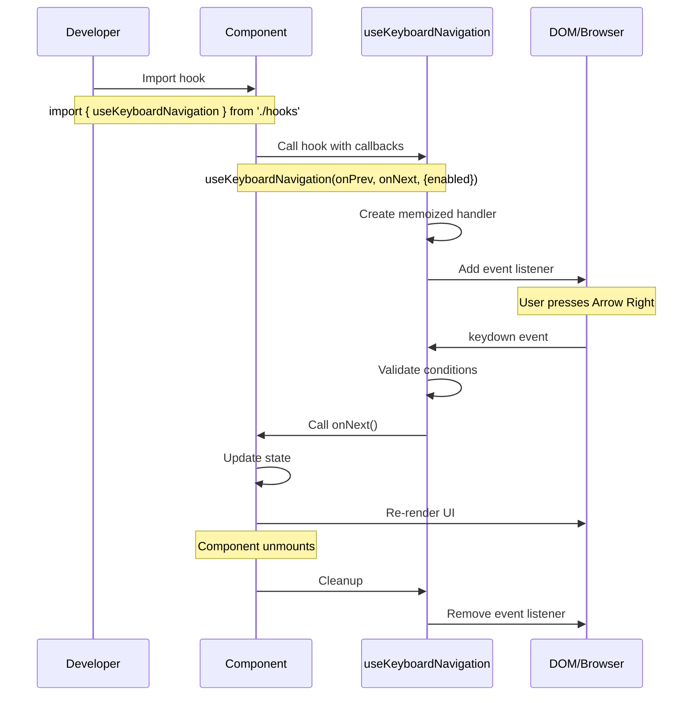

---

**Note:** These diagrams are written in Mermaid syntax and will render automatically on GitHub when viewing this file.

To view these diagrams locally, you can use:
- [Mermaid Live Editor](https://mermaid.live/)
- VS Code with Mermaid extension
- GitHub (renders automatically)
